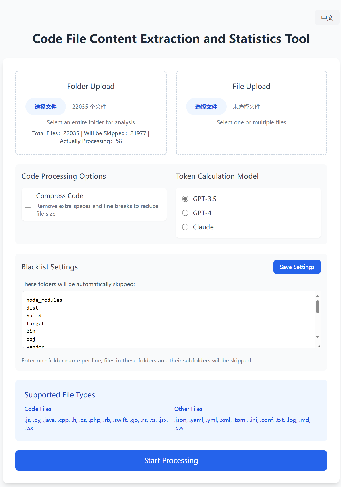
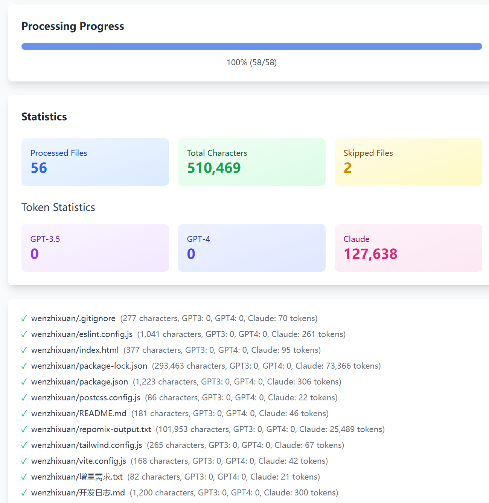

# 代码文件内容提取与统计工具
# Code File Content Extraction and Statistics Tool

[中文](#代码文件内容提取与统计工具) | [English](#code-file-content-extraction-and-statistics-tool-1)

---

# 代码文件内容提取与统计工具

一个用于提取和统计代码文件内容的Web工具，特别适合准备用于大语言模型（如GPT、Claude）的代码分析。

## 界面预览

*Main Interface - Supporting file upload and configuration*

*Statistics Result - Showing detailed token and character statistics*

## 功能特点

- 📁 支持文件夹和单个文件上传
- 🔍 自动识别和过滤二进制文件
- 📊 提供详细的统计信息
  - 字符数统计
  - 多种模型的Token计算（GPT-3.5、GPT-4、Claude）
- ⚡ 代码压缩功能
- 🚫 智能文件夹过滤系统
- 📥 自动生成汇总文本文件

## 支持的文件类型

### 代码文件
- JavaScript (.js)
- Python (.py)
- Java (.java)
- C++ (.cpp, .h)
- C# (.cs)
- PHP (.php)
- Ruby (.rb)
- Swift (.swift)
- Go (.go)
- Rust (.rs)
- TypeScript (.ts)
- JSX/TSX (.jsx, .tsx)

### 配置和文本文件
- JSON (.json)
- YAML (.yaml, .yml)
- XML (.xml)
- TOML (.toml)
- INI (.ini)
- 配置文件 (.conf)
- 文本文件 (.txt)
- 日志文件 (.log)
- Markdown (.md)
- CSV (.csv)

## 使用方法

1. **文件选择**
   - 点击"文件夹上传"选择整个项目文件夹
   - 或点击"文件上传"选择单个或多个文件

2. **黑名单设置**
   - 查看和编辑需要排除的文件夹
   - 默认排除常见的依赖文件夹（如 node_modules）
   - 可自定义添加需要排除的文件夹

3. **处理选项**
   - 选择是否压缩代码（删除多余空白）
   - 选择目标模型（影响Token计算方式）

4. **开始处理**
   - 点击"开始处理"按钮
   - 等待处理完成
   - 自动下载汇总文件

## 统计信息

工具会提供以下统计数据：
- 处理的文件总数
- 跳过的文件数
- 总字符数
- 各模型的预估Token数
  - GPT-3.5
  - GPT-4
  - Claude

## 本地部署

1. 下载项目文件
2. 直接在浏览器中打开 `index.html` 文件
3. 无需安装其他依赖，所有必要的库都通过CDN加载

## 注意事项

- 所有处理都在浏览器本地进行，不会上传文件到服务器
- 大文件夹处理可能需要一定时间，请耐心等待
- 建议使用现代浏览器（Chrome、Firefox、Edge等）以获得最佳体验
- 某些文件可能因编码问题无法正确读取

## 技术栈

- HTML5
- Tailwind CSS
- JavaScript
- GPT-3 Tokenizer
- js-beautify

## 贡献

欢迎提交Issue和Pull Request来改进这个工具。

## 许可证

MIT License

---

# Code File Content Extraction and Statistics Tool

A web-based tool for extracting and analyzing code file contents, particularly suitable for preparing code analysis for Large Language Models (like GPT, Claude).

## Interface Preview

*Main Interface - Supporting file upload and configuration*

*Statistics Result - Showing detailed token and character statistics*

## Features

- 📁 Support for folder and single file uploads
- 🔍 Automatic binary file detection and filtering
- 📊 Detailed statistics
  - Character count
  - Token calculation for various models (GPT-3.5, GPT-4, Claude)
- ⚡ Code compression functionality
- 🚫 Smart folder filtering system
- 📥 Automatic summary text file generation

## Supported File Types

### Code Files
- JavaScript (.js)
- Python (.py)
- Java (.java)
- C++ (.cpp, .h)
- C# (.cs)
- PHP (.php)
- Ruby (.rb)
- Swift (.swift)
- Go (.go)
- Rust (.rs)
- TypeScript (.ts)
- JSX/TSX (.jsx, .tsx)

### Configuration and Text Files
- JSON (.json)
- YAML (.yaml, .yml)
- XML (.xml)
- TOML (.toml)
- INI (.ini)
- Configuration files (.conf)
- Text files (.txt)
- Log files (.log)
- Markdown (.md)
- CSV (.csv)

## How to Use

1. **File Selection**
   - Click "Upload Folder" to select an entire project folder
   - Or click "Upload File" to select single or multiple files

2. **Blacklist Settings**
   - View and edit folders to exclude
   - Common dependency folders (like node_modules) are excluded by default
   - Customize additional folders to exclude

3. **Processing Options**
   - Choose whether to compress code (remove excess whitespace)
   - Select target model (affects token calculation)

4. **Start Processing**
   - Click "Start Processing" button
   - Wait for processing to complete
   - Summary file downloads automatically

## Statistics

The tool provides the following statistics:
- Total files processed
- Number of files skipped
- Total character count
- Estimated token count for various models
  - GPT-3.5
  - GPT-4
  - Claude

## Local Deployment

1. Download project files
2. Open `index.html` directly in your browser
3. No additional dependencies needed, all required libraries are loaded via CDN

## Notes

- All processing is done locally in the browser, no files are uploaded to servers
- Large folders may take some time to process, please be patient
- Recommended to use modern browsers (Chrome, Firefox, Edge, etc.) for best experience
- Some files may not be read correctly due to encoding issues

## Tech Stack

- HTML5
- Tailwind CSS
- JavaScript
- GPT-3 Tokenizer
- js-beautify

## Contributing

Issues and Pull Requests are welcome to improve this tool.

## License

MIT License
